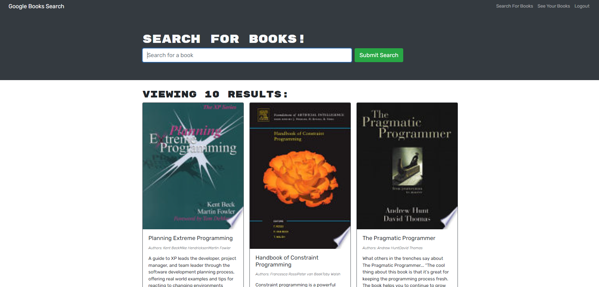

# Book Search GraphQL Migration 

## Description
This is an application that works as a book search engine. It allows a user to search for books and save them after signing in to their account. It originally ran a RESTful API and was migrated to GraphQL. [The application can be accessed here.](https://tranquil-everglades-81687.herokuapp.com/)

## Table of Contents
* [Installation](#installation)
* [Usage](#usage)
* [License](#license)
* [Contribution](#contribution)
* [Tests](#tests)
* [Questions](#questions)

## Installation 
This application can be installed by cloning this repository. You will then run `npm run build` in the root directory then `npm run develop` to start the application.

## Usage 
This application can be used in the heroku live link. First you will need to sign up with a username, email, and password. After that you can search for books and save them by clicking the save button. The saved books can then be viewed in the saved books page.

## License 
Copyright zachary-berdell-elliott

Permission is hereby granted, free of charge, to any person obtaining a copy of this software and associated documentation files (the “Software”), to deal in the Software without restriction, including without limitation the rights to use, copy, modify, merge, publish, distribute, sublicense, and/or sell copies of the Software, and to permit persons to whom the Software is furnished to do so, subject to the following conditions:

  The above copyright notice and this permission notice shall be included in all copies or substantial portions of the Software.
    
  THE SOFTWARE IS PROVIDED “AS IS”, WITHOUT WARRANTY OF ANY KIND, EXPRESS OR IMPLIED, INCLUDING BUT NOT LIMITED TO THE WARRANTIES OF MERCHANTABILITY, FITNESS FOR A PARTICULAR PURPOSE AND NONINFRINGEMENT. IN NO EVENT SHALL THE AUTHORS OR COPYRIGHT HOLDERS BE LIABLE FOR ANY CLAIM, DAMAGES OR OTHER LIABILITY, WHETHER IN AN ACTION OF CONTRACT, TORT OR OTHERWISE, ARISING FROM, OUT OF OR IN CONNECTION WITH THE SOFTWARE OR THE USE OR OTHER DEALINGS IN THE SOFTWARE.

## Contribution 
This application can be contributed to by contacting me with any issues.

## Tests 
This application can be tested at the heroku live link or be tested by installing it. 

## Questions 
FAQ: 

There are currently no frequently asked questions.

If you have any additional questions, please contact me at zacharyberdell@gmail.com to receive an answer to your question. If you would like to view other projects by me then [visit my profile here.](https://github.com/zachary-berdell-elliott)
